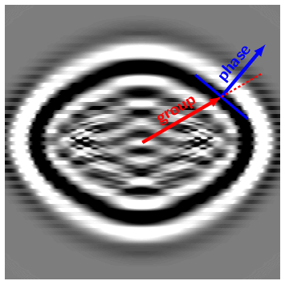

# AR web examples for my defense

## What and how
The examples illustrate complexity of slowness and ray surfaces of quasi-shear waves in anisotropic media. To run the examples, you will need a phone or a laptop with a camera and the [marker](https://raw.githubusercontent.com/yuriyi/Defense-AR/master/source/images/phd.png) either printed or displayed on another device.

## Instructions
1. Open any link from the list below on your device. Start with [test](https://yuriyi.github.io/Defense-AR/apps/test.html) to check the functionality
2. Give access to the camera
3. Point the camera at the [marker](https://raw.githubusercontent.com/yuriyi/Defense-AR/master/source/images/phd.png)
4. Use the button on top of the screen to toggle between two shear-waves
5. Feel free to move either the marker or the device
6. Enjoy!

Here is a difference between phase (or wavefront) and group (or energy propagation) directions in anisotropic world:

## Test model

- **Test** : Test example to see if AR works on your device. [Test](https://yuriyi.github.io/Defense-AR/apps/test.html)

## Relatively simple model

- **Phase domain**: Slowness surfaces of the quasi shear waves in an orthorhombic model. [Phase surfaces](https://yuriyi.github.io/Defense-AR/apps/phase.html)

- **Group domain**: Group velocity surfaces of the quasi shear waves in an orthorhombic model. [Wave surfaces](https://yuriyi.github.io/Defense-AR/apps/group.html)

## Mindnumbingly complicated stuff

- **Phase domain**: Slowness surfaces of the quasi shear waves in an orthorhombic model with 16(!) singularity directions. [Phase surfaces](https://yuriyi.github.io/Defense-AR/apps/phase_singularities.html)

- **Group domain**: Group velocity surfaces of the quasi shear waves in an orthorhombic model with 16(!) singularity directions. [Wave surfaces](https://yuriyi.github.io/Defense-AR/apps/group_singularities.html)

The stuff above is made possible by [AR.js](https://github.com/jeromeetienne/AR.js) and [three.js](https://github.com/mrdoob/three.js/) libraries. Phase and group velocity surfaces triangulation is done using ANISRF routine of the package [FORMS](http://sw3d.mff.cuni.cz/software/sw3dcd21/forms/forms.htm)
